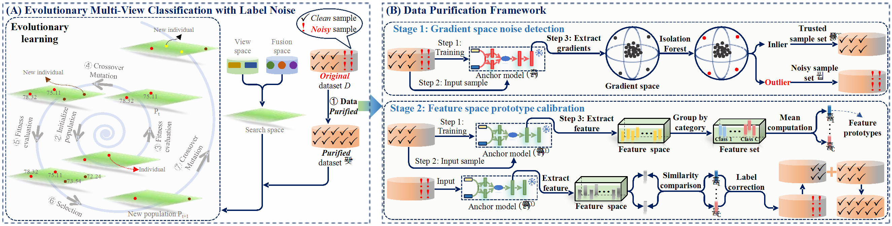

_**This paper has been accepted to ICML 2026 as a Spotlight.**_

<h2 align="center"> <a href="https://icml.cc/virtual/2026/poster/63057">Evolutionary Multi-View Classification with Label Noise via Gradient and Feature Dual-Perception</a></h2>

<div align="center">

**[_Shuai Li_<sup>1</sup>](https://lishuailzn.github.io/), [Xinyan Liang<sup>1*</sup>](https://xinyanliang.github.io/), [_Yuhua Qian_<sup>1</sup>](http://dig.sxu.edu.cn/qyh/), _Li LV_<sup>1</sup>**

<sup>1</sup>Institute of Big Data Science and Industry, Key Laboratory of Evolutionary Science Intelligence of Shanxi Province, School of Artificial Intelligence, Shanxi University<br>


<a href='https://icml.cc/virtual/2026/poster/63057'></a>&nbsp;

</div>


## Abstract
This paper studies a fundamental yet often overlooked premise in evolutionary multi-view classification (EMVC): the impact of label noise on EMVC, such as distorting fitness landscapes shaped by individual fitness values (e.g., test accuracy).
Traditional EMVC assumes training labels are noise-free, yet this often fails in practice.
As a result, label noise introduces harmful supervision during the training phase, resulting in distorted fitness landscapes and the emergence of fitness evaluation bias (FEB). This bias misguides the evolutionary trajectory, causing the search process to stagnate in local optima. 
Given that label noise largely stems from the mislabeling of samples near their decision boundaries by human annotators, we thus compared the decision boundaries of human annotators and models, and found discrepancies between the two. Based on this observation, we propose a simple yet effective ``detect-then-calibrate" data purification framework that leverages outlier analysis in the gradient space (i.e., treating outliers as noisy samples) and prototype calibration in the feature space (i.e., utilizing feature prototypes of noise-free samples to correct the labels of noisy samples).
Experimental results demonstrate that this strategy can effectively purify the data and alleviate FEB; furthermore, it can improve the performance of various multi-view learning paradigms in label noise scenarios.

## 🏗️Model
<div align="center">
  
</div>


## 🖥️ Computing Environment
The computing environment includes Ubuntu 24.04.2 LTS as the operating system, equipped with an AMD EPYC processor with 160 physical cores (320 logical threads), 566 GB of DDR4 memory, and 8 NVIDIA GeForce RTX 5090 GPUs, each with 32 GB of VRAM.


## 🧪 Experimental Setup
In our experiments,
- For the label noise learning comparison experiments, to ensure consistency with existing methods, we implement all experiments using the PyTorch framework (PyTorch 2.8.0+cu128, Python 3.10.18, CUDA 12.8).
- For the multi-view learning comparison experiments, we implement all experiments using TensorFlow framework (TensorFlow 2.10.0 GPU, Python 3.9.23, CUDA 11.2).

  

## 🎞️Experiment
In this experiment, we aim to verify whether the proposed method can effectively purify the data and alleviate the FEB problem.
### Data

#### _(1)_ Multi-view Datasets
We used five multi-view datasets in this experiment:

| Datasets            | Dataset URL                                            |    Password      | 
|---------------------|--------------------------------------------------------|------------------|
| MVoxCeleb           | [link](https://pan.baidu.com/s/1k6DN1m64bnrRfLK8RiFmqQ)|     ls12         |
| YoutubeFace         | [link](https://pan.baidu.com/s/1SVTWfHpAUdFWwiU5o-kD7Q)|     ls34         | 
| NUS-WIDE-128 (NUS)  | [link](https://pan.baidu.com/s/1udO5jvolHIbd8lOV3w4SYA)|     ls56         | 
| Reuters5            | [link](https://pan.baidu.com/s/1j8pmo88vXsO9pBWQiHVmYA)|     ls78         | 
| Reuters3            | [link](https://pan.baidu.com/s/1ti4OWqXTVnPDhsZ7VjahGQ)|     ls10         | 


For these five multi-view datasets, we only provide the original clean data. You can generate noisy versions with our official noise injection code, or add noise flexibly based on your own experimental needs.


#### _(2)_ CIFAR Datasets with Label Noise
The CIFAR-10N and CIFAR-100N datasets used in this work can be downloaded from http://noisylabels.com.

### Experiment Workflow
To alleviate the FEB problem caused by label noise, we adopt a two-stage strategy of gradient space detection + feature space calibration to purify the given dataset.The specific procedure is as follows:
- Step 1: Train the anchor model with the original dataset.
- Step 2: Perform outlier detection on the original dataset and regard outlier samples as potential noisy samples.
- Step 3: Remove potential noisy samples from the original dataset to obtain a primary purified dataset, and retrain the anchor model.
- Step 4: Use the retrained anchor model to correct the labels of potential noisy samples.
- Step 5: Retrain the anchor model with the final purified dataset.

#### Training
1. **Pre-training EN and extracting logits**
```bash
python code/train_T.py
python code/gain_T_logits.py
```
2. **Constructing the mutual information matrix**
```bash
python code/HSIC/kernel_matrix.py
python code/HSIC/HSIC.py
```
3. **The EMVC method driven by unbiased fitness evaluation**
```bash
python code/train_tree_youtube.py
```

## 📑Citation
If you find this repository useful, please cite our paper:
```
@inproceedings{
liang2025EFB-EMVC,
title={Evolutionary Multi-View Classification via Eliminating Individual Fitness Bias},
author={Xinyan Liang, Shuai Li, Qian Guo, Yuhua Qian, Bingbing Jiang, Tingjin Luo, Liang Du},
booktitle={Proceedings of the Thirty-ninth Annual Conference on Neural Information Processing Systems},
year={2025},
}
```

## 🔬 Related Work
We list below the works most relevant to this paper, including but not limited to the following:<br>
**_Our research group [[link]](https://xinyanliang.github.io/publications/)_**
- Evolutionary deep fusion method and its application in chemical structure recognition, _IEEE TEVC21_, [[paper]](https://ieeexplore.ieee.org/document/9373673)
- Evolutionary multi-view classification via eliminating individual fitness bias, _NeurIPS25_, [[paper]](https://github.com/LiShuailzn/Neurips-2025-EFB-EMVC)
- Trusted multi-view classification via evolutionary multi-view fusion, _ICLR25_, [[paper]](https://openreview.net/pdf?id=M3kBtqpys5)
- DC-NAS: Divide-and-conquer neural architecture search for multi-modal classification, _AAAI24_, [[paper]](https://ojs.aaai.org/index.php/AAAI/article/view/29281)
- Core-structures-guided multi-modal classification neural architecture search, _IJCAI24_, [[paper]](https://www.ijcai.org/proceedings/2024/0440.pdf)
- CoMO-NAS: Core-structures-guided multi-objective neural architecture search for multi-modal classification, _ACM MM24_, [[paper]](https://dl.acm.org/doi/10.1145/3664647.3681351)
- A fast neural architecture search method for multi-modal classification via Knowledge Sharing, _IJCAI25_, [[paper]](https://www.ijcai.org/proceedings/2025/557)
- Multi-scale features are effective for multi-modal classification: An architecture search viewpoint, _IEEE TCSVT25_, [[paper]](https://ieeexplore.ieee.org/document/10700772)
- Core structure-guided multi-modal classification via monte carlo tree search, _IJMLC25_, [[paper]](https://link.springer.com/article/10.1007/s13042-025-02606-z)
- LogicNAS: Multi-view neural architecture search method for image sequence logic prediction, _IEEE TETCI25_, [[paper]](https://ieeexplore.ieee.org/document/11262275)


**_Others_**
- Enhancing multimodal learning via hierarchical fusion architecture search with inconsistency mitigation, _IEEE TIP25_, [[paper]](https://ieeexplore.ieee.org/stamp/stamp.jsp?tp=&arnumber=11134693)
- Enhanced protein secondary structure prediction through multi-view multi-feature evolutionary deep fusion method, _IEEE TETCI25_, [[paper]](https://ieeexplore.ieee.org/abstract/document/10839444)
- MFAS: Multimodal fusion architecture search, _CVPR19_, [[paper]](https://openaccess.thecvf.com/content_CVPR_2019/papers/Perez-Rua_MFAS_Multimodal_Fusion_Architecture_Search_CVPR_2019_paper.pdf)
- BM-NAS: Bilevel multimodal neural architecture search, _AAAI22_, [[paper]](https://ojs.aaai.org/index.php/AAAI/article/view/20872)
- Deep multimodal neural architecture search, _ACMMM20_, [[paper]](https://dl.acm.org/doi/10.1145/3394171.3413977)
- Hierarchical multi-modal fusion architecture search for stock market forecasting, _Applied Soft Computing25_, [[paper]](https://www.sciencedirect.com/science/article/pii/S1568494625008920?casa_token=TZOWE_icAokAAAAA:YH8vB-WqZC03tYf8DV6WaVqMH78aoprjybDSwEDQlF6nSJ0SrQrf1lFh-OHwzHDiYu-iFHz38U8)
- Harmonic-NAS: Hardware-aware multimodal neural architecture search on resource-constrained devices, _ACML23_, [[paper]](https://proceedings.mlr.press/v222/ghebriout24a/ghebriout24a.pdf)
- Multi-view information fusion based on federated multi-objective neural architecture search for MRI semantic segmentation, _IF25_, [[paper]](https://www.sciencedirect.com/science/article/abs/pii/S1566253525003744)
- Automatic fused multimodal deep learning for plant identification, _Frontiers in Plant Science25_, [[paper]](https://arxiv.org/pdf/2406.01455?)

<!-- ## 🙏 Acknowledgement -->


## 📬Contact
If you have any detailed questions or suggestions, you can email us: [lishuai_liuzhaona@163.com](mailto:lishuai_liuzhaona@163.com)
